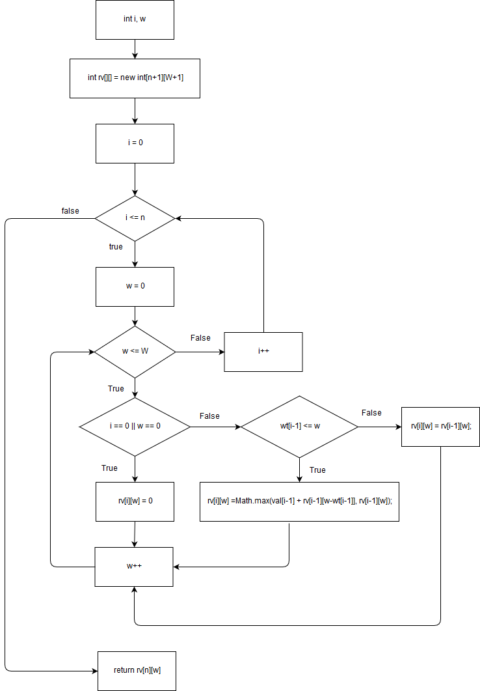

### **- Họ và tên: Hà Tuấn Phong**
### **- MSV: 16020263**
## **<u>1/Source code</u>**
#### https://github.com/TheAlgorithms/Java/blob/master/Dynamic%20Programming/Knapsack.java
```Java
1 private static int knapSack(int W, int wt[], int val[], int n)
2 {
3 	int i, w;
4 	int rv[][] = new int[n+1][W+1];    //rv means return value
5 	
6 	// Build table rv[][] in bottom up manner
7 	for (i = 0; i <= n; i++)
8 	{
9 		for (w = 0; w <= W; w++)
10		{
11			if (i==0 || w==0)
12				rv[i][w] = 0;
13			else if (wt[i-1] <= w)
14				rv[i][w] = Math.max(val[i-1] + rv[i-1][w-wt[i-1]], rv[i-1][w]);
15			else
16				rv[i][w] = rv[i-1][w];
17		}
18	}
19	
20	return rv[n][W];
21 }
```
## **<u>Flowchart</u>**


## **<u>2/Paths</u>**
#### **Path 1:** 7
#### **Path 2:** 7 &rarr; 9 &rarr; 7
#### **Path 3:** 7 &rarr; 9 &rarr; 11 &rarr; 9 &rarr; 7
#### **Path 4:** 7 &rarr; 9 &rarr; 11 &rarr; 13 &rarr; 9 &rarr; 7 
#### **Path 5:** 7 &rarr; 9 &rarr; 11 &rarr; 13 &rarr; 15 &rarr; 9 &rarr; 7

## **<u>3/Solve paths</u>**
## **Path 1:**
#### **<u>False</u>**: i <= n &rarr; n < 0
#### &rarr; n < 0
## **Path 2:**
#### **<u>True</u>**: i <= n &rarr; n >= 0
#### **<u>False</u>**: w <= W &rarr; W < 0
#### **<u>False</u>**: i <= n &rarr; n = 0
#### &rarr; n = 0, W < 0
## **Path 3:**
#### **<u>True</u>**: i <= n &rarr; n >= 0
#### **<u>True</u>**: w <= W &rarr; W >= 0
#### **<u>True</u>**: i == 0 || w == 0
#### **<u>False</u>**: w <= W &rarr; W = 0
#### **<u>False</u>**: i <= N &rarr; n = 0
#### &rarr; n = W = 0
## **Path 4:**
#### **<u>True</u>**: i <= n &rarr; n >= 0
#### **<u>True</u>**: w <= W &rarr; W >= 0
#### **<u>False</u>**: i == 0 || w == 0 &rarr; i > 0 && w > 0 &rarr; n > 0 && w > 0
#### **<u>True</u>**: wt[i-1] <= w;
#### **<u>False</u>**: w <= W &rarr; W = 1
#### **<u>False</u>**: i <=n &rarr; n = 1
#### &rarr; n = W = 1, wt[0] = 0
## **Path 5:**
#### **<u>True</u>**: i <= n &rarr; n >= 0
#### **<u>True</u>**: w <= W &rarr; W >= 0
#### **<u>False</u>**: i == 0 || w == 0 &rarr; i > 0 && w > 0 &rarr; n > 0 && w > 0
#### **<u>False</u>**: wt[i-1] <= w &rarr; wt[i-1] > w
#### **<u>False</u>**: w <= W &rarr; W = 1
#### **<u>False</u>**: i <=n &rarr; n = 1
#### &rarr; n = W = 1, wt[0] = 10
## **<u>4/Test case and expected results</u>**
## **Test 1:**
#### **Input**: n = -1
#### **Expected output**: 
## **Test 2:**
#### **Input**: n = 0, w = -1
#### **Expected output**: 
## **Test 3:**
#### **Input**: n = W = 0
#### **Expected output**: r[0][0] = 0
## **Test 4:**
#### **Input**: n = W = 1, wt[0] = 0
#### **Expected output**: not yet defined
## **Test 5:**
#### **Input**: n = W = 1, wt[0] = 10
#### **Expected output**: not yet defined

