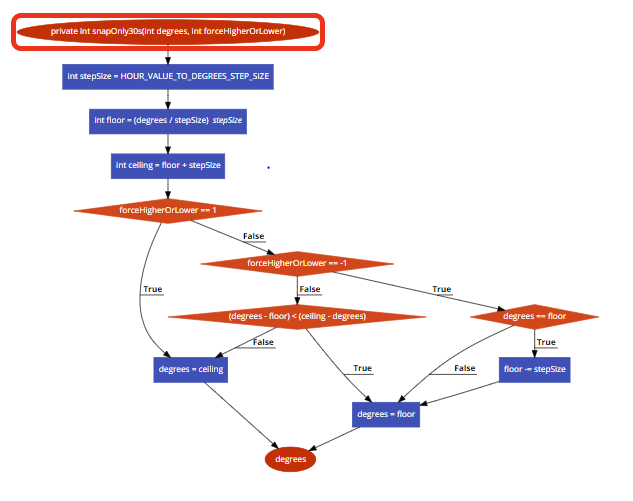

# Bài tập kiểm thử dòng điều kiện

#### Họ tên: Lê Hoàng
#### MSSV: 16020229
#### Lớp: K61-CA-CLC1
### **Chọn hàm từ repository**
### ***https://github.com/flavienlaurent/datetimepicker/blob/master/datetimepicker-library/src/com/sleepbot/datetimepicker/time/RadialPickerLayout.java***
### **Một số giá trị khởi tạo:** #
```
private static final int VISIBLE_DEGREES_STEP_SIZE = 30;
private static final int HOUR_VALUE_TO_DEGREES_STEP_SIZE = VISIBLE_DEGREES_STEP_SIZE;
```

### **Hàm snapOnly30s(int degrees, int forceHigherOrLower)**: #
```
1 private int snapOnly30s(int degrees, int forceHigherOrLower) {
2        int stepSize = HOUR_VALUE_TO_DEGREES_STEP_SIZE;
3        int floor = (degrees / stepSize) * stepSize;
4        int ceiling = floor + stepSize;
5        if (forceHigherOrLower == 1) {
6            degrees = ceiling;
7        } else if (forceHigherOrLower == -1) {
8            if (degrees == floor) {
9                floor -= stepSize;
10            }
11            degrees = floor;
12        } else {
13            if ((degrees - floor) < (ceiling - degrees)) {
14                degrees = floor;
15            } else {
16                degrees = ceiling;
17            }
18        }
19        return degrees;
20    }
```
## Bước 1 Lập flowchart:

## Bước 2 Liệt kê các đường đi:
### Đuờng đi 1: 
    1 -> 2 -> 3 -> 4 -> 5 -> 6 -> 19
### Đuờng đi 2: 
    1 -> 2 -> 3 -> 4 -> 5 -> 7 -> 8 -> 9 -> 10 -> 11 -> 19
### Đuờng đi 3: 
    1 -> 2 -> 3 -> 4 -> 5 -> 7 -> 8 -> 11 -> 19
### Đuờng đi 4: 
    1 -> 2 -> 3 -> 4 -> 5 -> 7 -> 12 -> 13 -> 14 -> 19
### Đuờng đi 5:
    1 -> 2 -> 3 -> 4 -> 5 -> 7 -> 12 -> 13 -> 15 -> 16 -> 17 -> 19

## Bước 3: Lập phương trình cho mỗi đường đi:
### Đuờng đi 1:
    forceHigherOrLower = 1

- Vậy phương trình duy nhất là: 

        forceHigherOrLower = 1
### Đuờng đi 2: 
    forceHigherOrLower = -1 && degrees = floor
        degrees = floor <=> degrees = (degrees / stepSize) * stepSize
                        <=> degrees % stepSize = 0 
                        <=> degrees % 30 = 0
                        <=> degrees = 30*m with m belong to N

- Vậy hệ gồm:
        
        forceHigherOrLower = -1
        
        degrees = 30*m with m belong to N
### Đuờng đi 3:
    forceHigherOrLower = -1 && degrees != floor
        degrees != floor <=> degrees % 30 != 0
                        <=> degrees = 30*m + n 
                                with m,n belong to N
                                 and n < 30
- Vậy hệ gồm:

        forceHigherOrLower = -1 
       
        degrees = 30*m + n (with m,n belong to N and n < 30)
### Đuờng đi 4:
    forceHigherOrLower != 1 && forceHigherOrLower != -1 && (degrees - floor) < (ceiling - degrees)
        (degrees - floor) < (ceiling - degrees)
        <=> 2*degrees < ceiling + floor
        <=> 2*degrees < floor + stepSize + floor
        <=> 2*degrees < 2*floor + stepSize
        <=> 2*degrees < (degrees/stepSize) *2*stepSize)) + stepSize
        <=> 2*degrees < (degrees/30) * 60 + 30
        <=> degrees -15 < (degrees/30) * 30
        <=> degrees - (degrees/30)*30 < 15
        hay degrees % 30 < 15
        <=> degrees = 30*m + n 
                with m,n belong to N
                 and n<15
        
- Vậy hệ gồm:

        forceHigherOrLower != 1
        
        forceHigherOrLower !=-1
        
        degrees = 30*m + n (with m,n belong to N and n<15)
### Đuờng đi 5: 
        Giống đường đi 4 nhưng :
        (degrees - floor) >= (ceiling - degrees)
        <=> degrees = 30*m + b 
                with m,n belong to N and 15 <= n < 30

- Vậy hệ gồm:
        
        forceHigherOrLower != 1
        
        forceHigherOrLower !=-1
        
        degrees = 30*m + n 
                (with m,n belong to N and 15 <= n < 30)
## Bước 4: Tính giá trị mong đợi và tạo bộ kiểm thử:
### Đuờng đi 1:
        Input:
                degree = 30
                forceHigherOrLower = 1
        Expect: 60
### Đuờng đi 2:
        Input:
                forceHigherOrLower = -1 
                degrees = 30*2 = 60       
        Expect: 30
### Đuờng đi 3:
        Input:
                forceHigherOrLower = -1
                degrees = 30*2 + 1 = 61       
        Expect: 60
### Đuờng đi 4:
        Input:
                forceHigherOrLower = 2
                degrees = 30*2 + 1 = 61       
        Expect: 60
### Đuờng đi 5:
        Input:
                forceHigherOrLower = 2
                degrees = 30*2 + 15 = 75      
        Expect: 90


